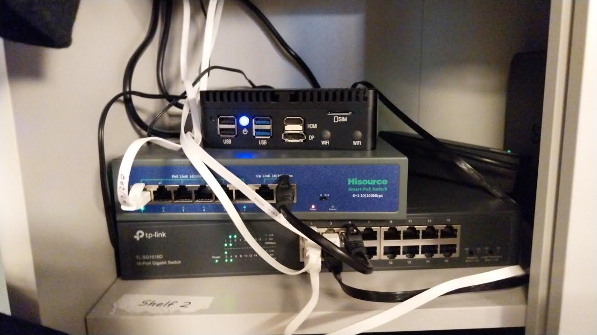

# Home Assistant - Starter List

May 29

A few friends have asked me "what do you recommend to get going with Home Assistant."

This is a short (and maybe somewhat sweet) summary (timestamp: May 29-2025).

The notes are opinionated

# Hardware

## Mini PC, Industrial PC, NIC

If you're getting into HA, my first recommendation: buy a dedicated piece of hardware to run it on. 

You *can* run Home Assistant on top of almost anything: a VM, a container. 

But remember: this device will be controlling everything in your home. 

Simply to facilitate primitive debugging ("does the device have power?") I'd go with a bare metal installation on something like a mini PC.

For reliability, ethernet/wired connectivity is highly recommended. 

If you want to go all-in on the reliability/uptime, consider implementing failover internet (backing your main line with something secondary like a cellular connection). You can implement this easily if you buy a dual WAN firewall.

## A UPS

I also strongly recommend ensuring that both the device running HA and the device running your networking (or devices - e.g. model + firewall) are on a UPS.

None of these things (mini PC, firewall, router) are very high draw. All can comfortably fit on one UPS.

You can fork off of it using an IEC to plug adapter.

This is a networking/HA stack with:

1) Home Assistant mini PC  
2) Ethernet switch  
3) POE switch to drive the Zigbee coordinator  

## Zigbee Coordinator

I use the SMLight SLZB-06. It's a stellar piece of hardware (but probably already a bit outdated).

.

See what people recommend on the HA subreddit or forums. If somethiing is widely used and respected by users ... it's hard to go wrong. 

You will have to choose between ZHA and MQTT. I recommend MQTT.

## Zigbee Repeaters

Almost certainly unnecessary as Zigbee sets up its own mesh but ... some would say they can't hurt.

---

## Networking Setup

I try to use Zigbee wherever possible. But for Wifi:

- Most smart stuff wants to run on 2.4 Ghz
- I couldn't trust most generic IoT devices as far as I can throw them. 

If you have time and share my general cautious approach to newtorking:

- Put untrtusted IoT devices on their own 2.4 Ghz Network (you could have a dedicated mesh)  
- Implement separation between your LAN and this network  

Alternatively:

- Set up a VLAN 

---

## Smart Home Hardware

You can control "stuff" in a few ways:

- If it has a HA integration ... by that  
- You can buy Tuya stuff and connect via a Tuya integration (these mostly work on 2.4 Ghz Wifi)
- You can find Zigbee devices that work with a Zigbee coordiantor  

Then there's:

- Proprietary hardware gateways like IKEA's  
- Bluetooth
- Other protocols like Z-Wave  

I'm waiting for somebody to come up with (ie invent/make) the "all in one smart home gateway" ... a unified hardware device with transmitters for all common protocols. But pending that ... I recommend starting small and keeping it simple. Zigbee and Wifi should be enough for 99% of use-cases.

And here's my strongest recommendation and "rules":  

- Try to use Zigbee wherever possible (even though, as you will discover, the hardware is more expensive)  
- Minimise the use of locked down third party ecosystems (like Tuya) whenever possible. 

## Why Not To Buy Tuya

If you live in Israel and are buying smart home stuff, Aliexpress is almost certainly where you're going to look first. Search for anything (try 'smart lightbulb') and you will find that 99% of devices are: Tuya, unbranded variants, etc. 

You *can* install Tuya stuff in HA by pairing with their app, *then* installing the HA integration. You can then try to wrest control of the devices out of Tuya's hands by registering as a developer on Tuya and hoping that you can figure out Local Tuya.

Advice that will save you time: don't bother. 

Or ask yourself this: if I want to turn on the light in my bathroom, should the data to do that travel to China and back? If you share my belief that that is: a) illogical and b) a bit sketchy then pay the Zigbee premium (which will probably erode over time). There is no reason why smart home hardware which you purchased should leave your LAN.

# Software

## HAOS

Install Home Assistant via HAOS. 

Advice: do not waste time trying to install HA in any other way (like as a container).

A dedicated box and a bare metal install are small investments in setting up a smart home.

## Use ChatGPT (no, really)

Smart homes are awesome but ... they can be a time suck. 

I use ChatGPT (and even Windsurf) liberally to take the tedium out of writing automations. 

How to do that:

- Create an API token in HA 
- Mop up your device entity names 

Then:

- Use that as context data to prompt AI 

For the security-cautious this approach avoids directly exposing your smart home to AI tools. 

---

## Final Advice 

MQTT is brilliant. 

A few tips for Zigbee2MQTT:

- Avoid the temptation to make "friendly names" nice on the eyes. Stick to whatever_this_case_is_called (I always forget) to avoid the potential pitfalls of having space escapes in your topic names causing problems  
- Install MQTT Explorer on your desktop. Just watch the payloads move across your network. This is as good way to learn by quiet observation how the protocol works. From there, you can move onto sending payloads to do things. 

## Communities

