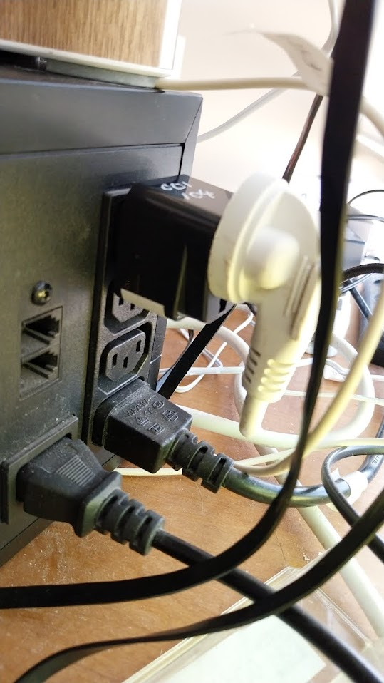

# Home Assistant - Starter List

May 29

A few friends have asked me "what do you recommend to get going with Home Assistant."

This is a short (and maybe somewhat sweet) summary (timestamp: May 29-2025).

The notes are opinionated

## Table of Contents

- [Hardware](#hardware)
  - [Mini PC, Industrial PC, NIC](#mini-pc-industrial-pc-nic)
  - [A UPS](#a-ups)
  - [Zigbee Coordinator](#zigbee-coordinator)
  - [Zigbee Repeaters](#zigbee-repeaters)
  - [Networking Setup](#networking-setup)
  - [Smart Home Hardware](#smart-home-hardware)
  - [Why Not To Buy Tuya](#why-not-to-buy-tuya)
- [Software](#software)
  - [HAOS](#haos)
  - [Use ChatGPT (no, really)](#use-chatgpt-no-really)
  - [Final Advice](#final-advice)
- [Remote Access](#remote-access)
- [Shopping Lists](#shopping-lists)
  - [Essential Hardware Shopping List](#essential-hardware-shopping-list)
  - [Smart Home Devices Shopping List](#smart-home-devices-shopping-list)
  - [Shopping in Israel](#shopping-in-israel)
- [Time Investment](#time-investment)
- [Communities](#communities)
- [My Personal Home Assistant Do's and Don'ts](#my-personal-home-assistant-dos-and-donts)

# Hardware

## Mini PC, Industrial PC, NIC

If you're getting into HA, my first recommendation: buy a dedicated piece of hardware to run it on. 

You *can* run Home Assistant on top of almost anything: a VM, a container. 

But remember: this device will be controlling everything in your home. 

Simply to facilitate primitive debugging ("does the device have power?") I'd go with a bare metal installation on something like a mini PC.


For reliability, ethernet/wired connectivity is highly recommended. 

If you want to go all-in on the reliability/uptime, consider implementing failover internet (backing your main line with something secondary like a cellular connection). You can implement this easily if you buy a dual WAN firewall.

## A UPS

I also strongly recommend ensuring that both the device running HA and the device running your networking (or devices - e.g. model + firewall) are on a UPS.

None of these things (mini PC, firewall, router) are very high draw. All can comfortably fit on one UPS.

You can fork off of it using an IEC to plug adapter.




This is a networking/HA stack with:

1) Home Assistant mini PC  
2) Ethernet switch  
3) POE switch to drive the Zigbee coordinator  


## Zigbee Coordinator

I use the SMLight SLZB-06. It's a stellar piece of hardware (but probably already a bit outdated).

.

**Manufacturer:** [SMLight](https://smlight.tech/) - They're a small company making excellent ZigBee coordinators and they're really awesome to work with.

See what people recommend on the HA subreddit or forums. If somethiing is widely used and respected by users ... it's hard to go wrong. 

You will have to choose between ZHA and MQTT. I recommend MQTT.

## Zigbee Repeaters

Almost certainly unnecessary as Zigbee sets up its own mesh but ... some would say they can't hurt.

---

## Networking Setup

I try to use Zigbee wherever possible. But for Wifi:

- Most smart stuff wants to run on 2.4 Ghz
- I couldn't trust most generic IoT devices as far as I can throw them. 

If you have time and share my general cautious approach to newtorking:

- Put untrtusted IoT devices on their own 2.4 Ghz Network (you could have a dedicated mesh)  
- Implement separation between your LAN and this network  

Alternatively:

- Set up a VLAN 

---

## Smart Home Hardware

You can control "stuff" in a few ways:

- If it has a HA integration ... by that  
- You can buy Tuya stuff and connect via a Tuya integration (these mostly work on 2.4 Ghz Wifi)
- You can find Zigbee devices that work with a Zigbee coordiantor  

Then there's:

- Proprietary hardware gateways like IKEA's  
- Bluetooth
- Other protocols like Z-Wave  


I'm waiting for somebody to come up with (ie invent/make) the "all in one smart home gateway" ... a unified hardware device with transmitters for all common protocols. But pending that ... I recommend starting small and keeping it simple. Zigbee and Wifi should be enough for 99% of use-cases.

And here's my strongest recommendation and "rules":  

- Try to use Zigbee wherever possible (even though, as you will discover, the hardware is more expensive)  
- Minimise the use of locked down third party ecosystems (like Tuya) whenever possible. 

## Why Not To Buy Tuya

If you live in Israel and are buying smart home stuff, Aliexpress is almost certainly where you're going to look first. Search for anything (try 'smart lightbulb') and you will find that 99% of devices are: Tuya, unbranded variants, etc. 

You *can* install Tuya stuff in HA by pairing with their app, *then* installing the HA integration. You can then try to wrest control of the devices out of Tuya's hands by registering as a developer on Tuya and hoping that you can figure out Local Tuya.

Advice that will save you time: don't bother. 

Or ask yourself this: if I want to turn on the light in my bathroom, should the data to do that travel to China and back? If you share my belief that that is: a) illogical and b) a bit sketchy then pay the Zigbee premium (which will probably erode over time). There is no reason why smart home hardware which you purchased should leave your LAN.

# Software

## HAOS

Install Home Assistant via HAOS. 

Advice: do not waste time trying to install HA in any other way (like as a container).

A dedicated box and a bare metal install are small investments in setting up a smart home.

## Use ChatGPT (no, really)

Smart homes are awesome but ... they can be a time suck. 

I use ChatGPT (and even Windsurf) liberally to take the tedium out of writing automations. 

How to do that:

- Create an API token in HA 
- Mop up your device entity names 

Then:

- Use that as context data to prompt AI 


For the security-cautious this approach avoids directly exposing your smart home to AI tools. 

---

## Final Advice 

MQTT is brilliant. 

A few tips for Zigbee2MQTT:

- Avoid the temptation to make "friendly names" nice on the eyes. Stick to whatever_this_case_is_called (I always forget) to avoid the potential pitfalls of having space escapes in your topic names causing problems  
- Install MQTT Explorer on your desktop. Just watch the payloads move across your network. This is as good way to learn by quiet observation how the protocol works. From there, you can move onto sending payloads to do things. 

---

## Remote Access

For accessing your Home Assistant installation remotely, I personally use and recommend **Cloudflare Tunnel**.

### Cloudflare Tunnel Setup

Cloudflare Tunnel provides secure remote access without opening ports on your firewall or exposing your home IP address. It's free and reliable.

**Deployment Options:**
1. **Direct on Home Assistant**: Deploy the Cloudflare Tunnel directly onto the Home Assistant device
2. **Separate Device**: Run the tunnel on another device and tunnel to your HA instance

### Android App Authentication Issue

⚠️ **Important Note**: The only pitfall with Cloudflare Tunnel is that the Android Home Assistant app can have trouble authenticating when using Cloudflare Access for security.

**Workaround**: Instead of using Cloudflare Access, implement other security measures:
- Use Home Assistant's built-in authentication
- Implement IP restrictions if needed
- Consider additional security layers at the application level

### Pro Tips for Reliability

**Create Backup Endpoints**: Set up redundant access methods for maximum reliability:

1. **Primary Tunnel**: Main Cloudflare Tunnel on your Home Assistant device
2. **Backup Tunnel**: Secondary tunnel on another local device (like a Raspberry Pi or spare mini PC)

This ensures that if your main tunnel appliance isn't working for some reason, you still have remote access through the backup endpoint.

### SSH Access with Tailscale

For local operations and troubleshooting, install **Tailscale** alongside your Cloudflare setup:

- **Purpose**: Facilitates secure SSH access to your Home Assistant device
- **Use Case**: Remote administration, debugging, file transfers
- **Benefit**: Works even if your web-based access is having issues

**Recommended Setup:**
```
Internet → Cloudflare Tunnel → Home Assistant (Web UI)
Internet → Tailscale → Home Assistant (SSH/Admin)
```

This dual approach gives you both user-friendly web access and administrative access when needed.

---

## Shopping Lists

### Essential Hardware Shopping List

| Item | Approximate Price (USD) | Where to Buy | Notes |
|------|------------------------|---------------|-------|
| Mini PC (8GB RAM, 256GB SSD) | $200-400 | Amazon, Newegg | Look for Intel N100 or similar |
| UPS (600VA-1000VA) | $80-150 | Amazon, local electronics stores | Ensure IEC outlets |
| Ethernet Switch (8-port) | $25-50 | Amazon, networking stores | Unmanaged is fine |
| POE Switch (4-8 port) | $50-100 | Amazon, networking stores | For ZigBee coordinator |
| ZigBee Coordinator (SMLight SLZB-06) | $35-50 | [SMLight](https://smlight.tech/) | POE powered |
| Ethernet Cables (Cat6, various lengths) | $20-40 | Amazon, electronics stores | Buy a variety pack |
| IEC to plug adapters | $10-20 | Amazon, electronics stores | For UPS connectivity |

**Total Essential Setup: ~$420-810**

### Smart Home Devices Shopping List

| Item | Approximate Price (USD) | Where to Buy | Protocol |
|------|------------------------|---------------|----------|
| ZigBee E27 Smart Bulbs | $15-25 each | Amazon, Philips Hue | ZigBee |
| ZigBee Smart Switches | $20-40 each | Amazon, Aqara, Sonoff | ZigBee |
| ZigBee Motion Sensors | $15-30 each | Amazon, Aqara | ZigBee |
| ZigBee Door/Window Sensors | $10-20 each | Amazon, Aqara | ZigBee |
| ZigBee Smart Plugs | $15-25 each | Amazon, Sonoff | ZigBee |
| ZigBee Temperature Sensors | $15-25 each | Amazon, Aqara | ZigBee |
| ZigBee Repeaters (if needed) | $15-30 each | Amazon, IKEA | ZigBee |

### Shopping in Israel

For Israeli buyers, here are the best options:

| Store | Best For | Notes |
|-------|----------|-------|
| **AliExpress** | ZigBee devices, sensors, basic hardware | Longer shipping, but great prices |
| **Ivory PC** | Mini PCs, networking equipment, UPS | Local warranty, faster delivery |
| **Amazon** | Branded items, quick delivery | Higher prices but reliable |
| **Local Electronics Stores** | UPS, cables, basic networking | Immediate availability |

**Note:** While AliExpress has many Tuya devices, stick to ZigBee devices from reputable brands like Aqara, Sonoff, or IKEA for better integration.

---

## Time Investment

### Setup Phase (The Hardest Part)
The initial setup is definitely the most time-consuming part of your Home Assistant journey:

- **Hardware Setup:** 2-4 hours (assembling, connecting, basic networking)
- **HAOS Installation:** 1-2 hours (installation, initial configuration)
- **ZigBee Coordinator Setup:** 1-2 hours (MQTT broker, ZigBee2MQTT configuration)
- **First Device Pairing:** 1-2 hours (learning the process, troubleshooting)

**Total Initial Investment: 5-10 hours**

### Why Start with Dedicated Hardware?
The reason I recommend HAOS on dedicated hardware from the get-go is that **you're priming yourself for growth**. Here's why:

- **Avoid Migration Pain:** If you start with a container setup, you'll eventually outgrow it and want to move to dedicated hardware. Migration is time-consuming and can be frustrating.
- **Better Performance:** Dedicated hardware provides consistent performance and reliability.
- **Easier Troubleshooting:** Physical access to the device makes debugging much simpler.
- **Room to Grow:** As you add more devices and automations, you'll appreciate having dedicated resources.

### Ongoing Maintenance
Once set up, Home Assistant is relatively low-maintenance:
- **Monthly:** ~30 minutes (updates, checking logs)
- **Adding New Devices:** ~15-30 minutes per device (gets faster with experience)
- **Creating Automations:** Variable (but ChatGPT helps a lot!)

**Pro Tip:** Buy some extra Ethernet cable while you're at it - you'll inevitably need it for expanding your setup or troubleshooting connectivity issues.

---

## Communities

These communities are pretty helpful and you can turn to them for help with any Home Assistant questions or issues you encounter.

[](https://www.reddit.com/r/homeassistant/)

[](https://community.home-assistant.io/)

---

## My Personal Home Assistant Do's and Don'ts

| ✅ DO | ❌ DON'T | Why |
|-------|----------|-----|
| **Use Ethernet for the Home Assistant box** | **Use Wi-Fi for the Home Assistant box** | Wired connections are more reliable and faster. Wi-Fi can be unreliable for critical infrastructure, has potential for interference, and adds troubleshooting complexity. |
| **Use a dedicated piece of hardware** | **Use a non-dedicated host** | Dedicated hardware ensures consistent performance, makes troubleshooting easier, and prevents resource conflicts with other applications. |
| **Use Home Assistant OS** | **Use Home Assistant as a container or other deployment** | HAOS is the official deployment method with best support, simplified updates, integrated supervisor, and easy add-on management. Container deployments lack the integrated ecosystem. |
| **Use ZigBee for smart devices** | **Use Wi-Fi for smart devices (avoid where possible)** | ZigBee is more reliable, creates its own mesh network, and doesn't congest your Wi-Fi. Wi-Fi devices can overwhelm your network and have potential security concerns. |
| **Put networking gear and HA on a UPS** | **Trust your power supply to not go down** | UPS protects against outages, maintains functionality during brief interruptions, and prevents data corruption. Power outages are inevitable and sudden shutdowns can corrupt your HA database. |
